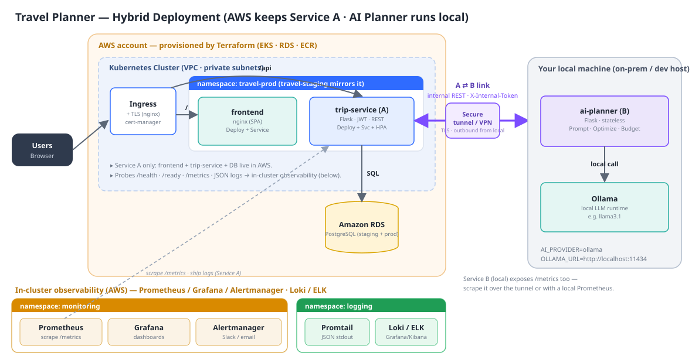
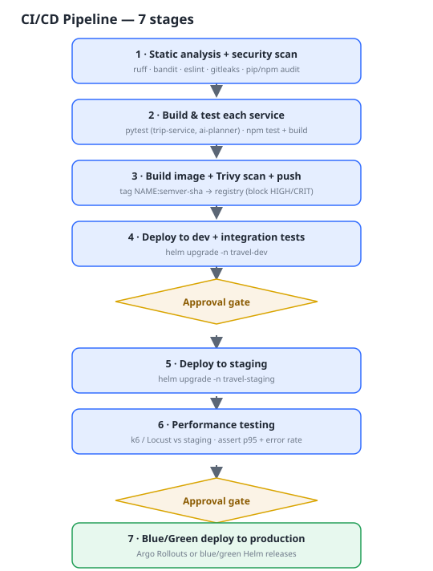
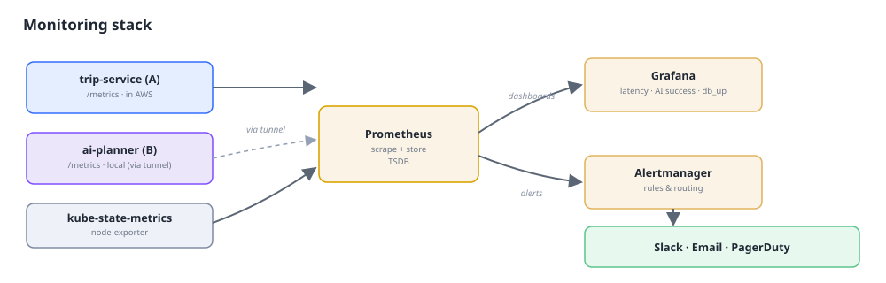

# Travel Planner — DevOps Architecture & Deployment Schema

How the platform requirements (Kubernetes, Helm, Terraform, CI/CD, Prometheus/
Grafana/Alertmanager, ELK/Loki) map onto the Travel Planner application.

- **Application repo (this one):** frontend + `trip-service` + `ai-planner-service`,
  Dockerfiles, `/metrics`, JSON logs, DB migrations. **← already built.**
- **This document:** the target-state DevOps architecture you implement in the
  infrastructure repo. See **[instruction.txt](instruction.txt)** for the actual
  step-by-step staging/prod setup.

> **Hybrid deployment.** AWS runs **Service A** (frontend + `trip-service` + RDS) in
> Kubernetes. **Service B (`ai-planner`) runs on your local machine** with a local
> **Ollama**. `trip-service` reaches it over a **secure tunnel / VPN** — the
> **A ⇄ B link** (§2b).

---

## 1. High-level deployment topology



**ASCII fallback:**

```
                                        [ AWS  ·  Kubernetes cluster ]
Users ─▶ Ingress(+TLS) ─┬─ "/"    ─▶ frontend (nginx)
                        └─ "/api" ─▶ trip-service (A) ─▶ Amazon RDS (PostgreSQL)
                                          │
                                          │  A ⇄ B : internal REST + X-Internal-Token
                                          │  over TLS  (VPN / reverse tunnel)
                                          ▼
                              ai-planner (B) ─▶ Ollama     [ your local machine ]

Prometheus ─scrape /metrics▶ trip-service (A)  [+ ai-planner (B) via the tunnel]
Alertmanager ─▶ Slack / email        Promtail/Fluent Bit ─stdout JSON▶ Loki / ELK
Each cloud environment = its own namespace (travel-staging, travel-prod).
```

---

## 2. Kubernetes workloads (Service A, per environment namespace)

Every cloud environment is an **isolated namespace** with the same objects, differing
only by Helm values (replicas, resources, image tag, secrets, hostnames).
**`ai-planner` (B) is NOT deployed to the cluster** — see §2b.

| Object | frontend | trip-service (A) |
|---|---|---|
| Deployment | nginx serving static SPA | gunicorn (Flask) |
| Service | ClusterIP :80 | ClusterIP :5001 |
| Ingress | `/` (public) | `/api` (public) |
| HPA | optional | CPU/RPS based |
| ConfigMap | — | non-secret env (incl. `AI_PLANNER_URL` = tunnel endpoint) |
| Secret | — | DB URL, JWT secret, `INTERNAL_API_TOKEN` |
| NetworkPolicy | — | allow from ingress; **egress to the tunnel endpoint** |
| Probes | `/` | `/health` (live), `/ready` (ready) |
| Pre-deploy | — | **migration Job** (`flask db upgrade`) |

**Routing.** Ingress path-routes `/`→frontend and `/api`→trip-service (build the
frontend with `VITE_TRIP_SERVICE_URL=""` for same-origin). Alternatively expose only
the frontend and let its built-in nginx proxy `/api`→`trip-service` (works as-is via
cluster DNS). **Service discovery & load balancing** = native Kubernetes Services
(stable DNS + L4 balancing across replicas) + Ingress for L7.

---

## 2b. Service B (AI Planner) on your local machine — the A ⇄ B link

`ai-planner` (B) runs **outside AWS**, on your local host, next to **Ollama**:

```
AWS: trip-service (A)  ──HTTPS──▶  [ secure tunnel / VPN ]  ──▶  ai-planner (B) ──▶ Ollama (localhost:11434)
                       X-Internal-Token                         (your local machine)
```

**Why a tunnel/VPN?** AWS cannot dial into a machine behind home/office NAT, so the
**local box establishes an outbound connection** and `trip-service` calls it through
that. Pick one:

| Option | How it works |
|---|---|
| **Cloudflare Tunnel** (`cloudflared`) | Local runs cloudflared → stable HTTPS hostname (e.g. `https://ai.example.com`). Lock down with Cloudflare Access / mTLS. *(recommended)* |
| **ngrok / inlets** | Local agent → public HTTPS URL. Simple; use auth + IP allowlist. |
| **WireGuard / site-to-site VPN / AWS Client VPN** | Local host joins the VPC network; `trip-service` calls it by private IP. |
| **SSH reverse tunnel** | `ssh -R` from local to a bastion in the VPC. Minimal, good for dev. |

**Wiring (env vars):**
- `trip-service` (in AWS): `AI_PLANNER_URL=https://<tunnel-endpoint>`,
  `INTERNAL_API_TOKEN=<shared-secret>`, `AI_PLANNER_TIMEOUT=120` (Ollama on local
  hardware can be slow).
- `ai-planner` (local): `AI_PROVIDER=ollama`, `OLLAMA_URL=http://localhost:11434`,
  `OLLAMA_MODEL=llama3.1`, `INTERNAL_API_TOKEN=<same-shared-secret>`.
  Run it with `docker compose up ai-planner-service` (this repo) + a running
  `ollama serve`.

**Security:** every call carries `X-Internal-Token` (constant-time checked) over
**TLS**; additionally restrict the tunnel (Cloudflare Access, IP allowlist, or mTLS)
and only expose `/api/plan` + `/api/optimize`. Keep `/metrics` off the public tunnel.

**Operational caveats:** the local host is a **single point of failure** for AI
planning and adds network latency. If it's unreachable, `POST /api/trips/:id/plan`
returns **503** and the UI degrades gracefully — everything else in AWS keeps working.

---

## 3. Infrastructure as Code (Terraform)

```
infra-repo/terraform/
├── backend.tf                # remote state: S3+DynamoDB (locking) / GCS / Azure blob
├── modules/
│   ├── network/             # VPC, subnets, security groups (network segmentation)
│   ├── cluster/             # EKS (or GKE / AKS) + node pools
│   ├── database/            # Amazon RDS PostgreSQL
│   └── registry/            # Amazon ECR
└── envs/
    ├── staging/             # calls modules with staging sizing
    └── prod/                # calls modules with prod sizing (HA, backups)
```

- **Remote state with locking** so the team never corrupts state.
- **Network segmentation:** private subnets for nodes + RDS; DB security group accepts
  traffic **only** from the cluster nodes; public access only via the LB. Allow
  **egress** from the `trip-service` nodes to the tunnel endpoint (§2b).
- Separate **staging and prod** stacks (own DB, own node pool) — blast-radius isolation.

---

## 4. Helm (package management)

One chart for **Service A**, one values file per environment.

```
infra-repo/charts/travel-planner/
├── Chart.yaml
├── values.yaml               # defaults
├── values-staging.yaml       # 1 replica, small resources, staging host/secrets
├── values-prod.yaml          # HA replicas, HPA, prod host, blue/green
└── templates/
    ├── frontend-*            # deployment, service, ingress
    ├── trip-service-*        # deployment, service, hpa, configmap, netpol
    ├── migration-job.yaml    # runs flask db upgrade (Helm hook: pre-install/upgrade)
    └── servicemonitor.yaml   # Prometheus Operator scrape config
```

`AI_PLANNER_URL` (the tunnel endpoint) + `INTERNAL_API_TOKEN` are supplied to
`trip-service` via ConfigMap/Secret. **`ai-planner` has no chart** — it runs locally
(§2b). Deploy A: `helm upgrade --install travel-planner ./charts/travel-planner -n travel-prod -f values-prod.yaml`

---

## 5. Containerization & image supply chain

- **Multi-stage builds** — done in the app repo (builder → slim runtime), all three images.
- **Security hardening** — images already run as a **non-root** user with a
  HEALTHCHECK. Harden further: pin base images by digest, drop Linux capabilities,
  `readOnlyRootFilesystem` + `runAsNonRoot`, consider distroless for the Python runtime.
- **Image scanning** — Trivy (or Snyk/Grype) as a **blocking** CI stage before push.
- **Versioning** — tag every image `NAME:<semver>-<git-sha>`; never deploy `latest`.
- The `ai-planner` image is still **built, tested and scanned in CI**, then **pulled to
  the local host** (or run from source) rather than deployed to the cluster.

---

## 6. CI/CD pipeline (the 7 required stages)



| Stage | Tooling for this project |
|---|---|
| 1. Static analysis + security | `ruff`/`flake8` + `bandit` (Python), `eslint` (JS), `pip-audit`/`npm audit`, secret scan (gitleaks) |
| 2. Build & test independently | `pytest` in each service; `npm test`/`npm run build` for frontend |
| 3. Image build + scan + push | Docker Buildx → Trivy scan → push to registry, tag `svc:semver-sha` |
| 4. Deploy to dev + integration | `helm upgrade --install ... -n travel-dev`; run API smoke/integration tests |
| 5. Promote to staging (gate) | Manual approval → deploy to `travel-staging` |
| 6. Performance testing | k6/Locust against staging Ingress; check p95 latency, error rate |
| 7. Blue/Green to prod | Argo Rollouts **or** two Helm releases (blue/green) + Service switch |

The K8s deploy stages (4–7) roll out **Service A**. The `ai-planner` image flows
through stages 1–3 and is then updated on the local host. **Blue/Green** for A: deploy
"green" beside "blue", verify `/ready` + smoke tests, flip the Service/Ingress
selector, keep "blue" for instant rollback.

---

## 7. Monitoring stack



- **Prometheus** (via `kube-prometheus-stack`) scrapes `trip-service` `/metrics`
  through a **ServiceMonitor**. Scrape **`ai-planner` (B)** over the tunnel (a static
  scrape target) or run a small local Prometheus/agent that remote-writes. The apps
  export custom metrics (`trips_created_total`, `ai_plan_requests_total`,
  `ai_generation_requests_total{provider}`, `trip_service_db_up`, latency histograms —
  full list in `forDevOps.txt` §9).
- **Grafana dashboards** — service health (up/ready), request rate & p95 latency,
  AI success/error rate & duration, DB up, pod CPU/memory.
- **Alertmanager** routes to Slack/email/PagerDuty. Starter alerts:
  - `trip_service_db_up == 0`
  - high `ai_plan_failures_total` / AI error ratio (catches the local box going down)
  - p95 latency over SLO ; pod crashloop / readiness flapping / node pressure.

> Set `PROMETHEUS_MULTIPROC_DIR` when running gunicorn with >1 worker so `/metrics`
> aggregates across workers (already wired in the images).

---

## 8. Logging (ELK / Loki)

- All services emit **structured JSON to stdout** (`timestamp, level, service,
  message, request_id, method, path`). Every response carries `X-Request-ID`.
- A node-level agent ships stdout to the store:
  - **Loki stack:** Promtail (DaemonSet) → Loki → view in Grafana. *(lighter)*
  - **ELK:** Filebeat/Fluent Bit → Elasticsearch → Kibana.
- `trip-service` logs ship from the cluster; **`ai-planner` logs are local** — tail
  them on the host or forward with a local agent for the same correlation by
  `request_id` (`trip-service` propagates it across the A ⇄ B call).

---

## 9. Git repositories (3, per the requirements)

| Repo | Contents |
|---|---|
| `travel-planner` (this) | frontend, `trip-service`, `ai-planner-service`, Dockerfiles, tests |
| `travel-planner-infra` | Terraform modules + envs, Helm chart (Service A), K8s manifests, dashboards, tunnel config |
| `travel-planner-cicd` | pipeline definitions, integration/performance test suites, promotion workflows |

---

## 10. Requirements coverage (from the platform doc)

| Requirement | Where / how |
|---|---|
| K8s deploy + namespaces for env isolation | §2 — `travel-staging` / `travel-prod` namespaces |
| Terraform IaC | §3 — `terraform/modules` + `envs` |
| Helm charts | §4 — `charts/travel-planner` + per-env values |
| Provision EKS/GKE/AKS | §3 — `cluster` module (EKS) |
| Remote state backend | §3 — `backend.tf` (S3+lock) |
| Network segmentation + security groups | §3 — `network` module + NetworkPolicies (§2) |
| Multi-stage Docker builds | **App repo — done** (all 3 images) |
| Custom base image hardening | §5 — non-root done; digest-pin, distroless, securityContext |
| Image scanning in pipeline | §5/§6 — Trivy blocking stage |
| CI/CD 7 stages | §6 |
| Prometheus + custom exporters | §7 — app `/metrics` + ServiceMonitor (B via tunnel) |
| Grafana dashboards | §7 |
| Alertmanager + notifications | §7 |
| Log aggregation (ELK/Loki) | §8 |
| Service discovery + load balancing | §2 — K8s Services + Ingress; §2b — tunnel endpoint for B |
| Hybrid AI Planner (local + Ollama) | **§2b — A ⇄ B secure link** |
| Env-specific config (dev/staging/prod) | §4 — per-env Helm values + Secrets/ConfigMaps |
| 3 Git repositories | §9 |

➡ **Next:** follow **[instruction.txt](instruction.txt)** to build staging and prod.
